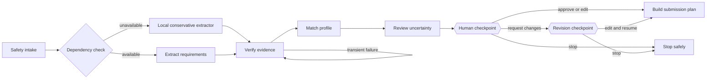

# PaperworkPilot Agent

**Evidence first. Human approved. Nothing submitted automatically.**

PaperworkPilot is a code-heavy, stateful AI agent that turns confusing forms into a verified submission plan. It does not merely summarize a document: it extracts requirements, verifies each item against source evidence, matches only user-supplied profile details, detects uncertainty, retries transient failures, pauses for human judgment, and resumes the same saved graph to create an ordered checklist.

This repository contains the complete frontend, backend, agent graph, tools, prompts, fixtures, tests, evaluation runner, Replit configuration, and project documentation.

**Live application:** [paperwork-pilot-ai.replit.app](https://paperwork-pilot-ai.replit.app/)


## Why this is an agent



The graph uses LangGraph checkpointing and `interrupt()` to preserve thread state while it waits for a reviewer. Separate demos make three control paths observable: verifier retry, extraction-dependency fallback, and reject → revise → resume on the same run.

## Verify it in 90 seconds

```bash
python -m pip install -r requirements.txt
python -m unittest discover -s test -v
python evaluation/run_evals.py
python -m uvicorn backend.app:app --port 3000
```

Then open `http://localhost:3000`. Run **Dependency outage recovery** to see local fallback with zero model calls. Run **Reject, revise, resume**, choose **Request changes**, edit the note, and resume the preserved run.

## What works

- PDF, PNG, JPG, WEBP, TXT, Markdown, and pasted-text intake up to 10 MB
- Local text extraction for normal PDFs; OpenAI vision fallback for images and scanned PDFs
- OpenAI Responses API with strict JSON Schema output and `store: false`
- Exact source quotes and evidence locations for fields, documents, and warnings
- Profile matching that never fills unknown values
- Prompt-injection isolation for instructions embedded in uploaded documents
- Seven observable pre-plan stages, retry with backoff, dependency fallback, and conditional routing
- Human approve/edit/request-changes/stop controls with two same-thread resumable checkpoints
- Interactive final checklist, copy action, and print/PDF output
- Five deterministic no-key demos plus a 12-case adversarial safety evaluation set
- A run receipt showing evidence coverage, recorded steps, recovery status, model-call count, and server runtime
- Gzip responses, short-lived static caching, one model call for low-risk forms, and a maximum of two for high-risk forms selected by the completeness gate

## Replit setup

1. Import this repository into a Python Repl.
2. Add `OPENAI_API_KEY` in **Secrets**.
3. Optionally set `OPENAI_MODEL`; the default is `gpt-5.4-mini`.
4. Click **Run**. Replit installs `requirements.txt` and uses the included `.replit` command.
5. Choose a scenario and click **Run selected demo** for a complete no-key demonstration.

### Demo suite

- **Parking permit (flagship):** ambiguous deadline, three attachments, simulated verifier recovery, and human approval.
- **School trip consent:** guardian profile matching, conditional medical paperwork, fee rules, and signature review.
- **Utility hardship:** sensitive identity data, income evidence, a notice-based deadline, and secure-channel routing.
- **Dependency outage recovery:** simulates an unavailable extraction dependency and visibly routes to the local conservative extractor.
- **Reject, revise, resume:** requests a change, preserves the checkpoint, and resumes the same run after a revised instruction.

Matching plain-text fixtures live in `samples/` for upload and paste demonstrations.

The deterministic demos do not require an API key. Pasted text also has a conservative local fallback when the model is unavailable. Image and scanned-PDF extraction requires `OPENAI_API_KEY`.

## Local setup

```bash
python -m venv .venv
# Windows: .venv\Scripts\activate
# macOS/Linux: source .venv/bin/activate
pip install -r requirements.txt
python -m uvicorn backend.app:app --reload --port 3000
```

Open `http://localhost:3000`.

## Validation

```bash
python -m unittest discover -s test -v
python evaluation/run_evals.py
```

The automated checks cover API contracts, dependency failure, verifier retry, reject/revise/resume, safe stop, exact evidence coverage, prompt injection, sensitive-field routing, UI contracts, latency headers, cost controls, and the zero-invented-answer boundary.

## Repository map

```text
agent/          LangGraph state, nodes, schemas, tools, prompt, and demo fixture
assets/         Animated product demonstration
backend/        FastAPI routes, file intake, run/resume/status/delete API
public/         Complete responsive frontend
test/           Unit, API integration, and UI contract tests
evaluation/     Week 3 safety fixtures plus the 40-case Week 4 LangSmith benchmark and reporting tools
samples/        Fictional, upload-ready demonstration forms
docs/           Project write-up, architecture, and evaluation notes
```

## Safety boundary

PaperworkPilot provides navigation—not legal, tax, medical, immigration, financial, or eligibility advice. It never invents personal information, submits a form, sends a message, pays a fee, or performs another external write. The final artifact requires human approval. Session checkpoints are held in process memory and expire when the service restarts or the run is deleted.

## Submission materials

- [Project documentation](docs/PROJECT.md)
- [Technical architecture](docs/ARCHITECTURE.md)
- [Evaluation report](docs/EVALUATION.md)
- [Live application and demo instructions](LIVE_DEMO.md)

## Week 4: measured agent evaluation

The `evaluation/` folder now contains a separate Week 4 benchmark and LangSmith experiment system:

- 40 labeled cases with the required 50% happy / 30% edge / 15% known-failure / 5% adversarial mix
- Six deterministic evaluators and an optional human-calibrated LLM judge
- A frozen baseline and a risk-routed selective completeness-audit variant
- Case-level LangSmith tracing, model/token/cost metadata, and experiment links
- Automatic baseline-versus-improved delta report and failure clustering

Start with [the Week 4 evaluation design](docs/WEEK4_EVALUATION.md) and [the dataset review protocol](evaluation/DATASET_REVIEW.md). Draft labels must be owner-reviewed before the submitted LangSmith dataset is created.
